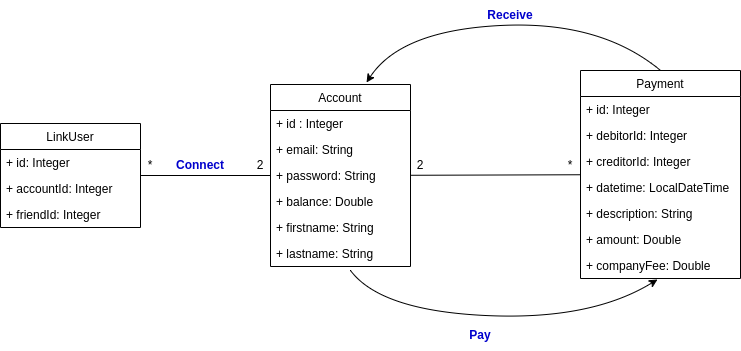
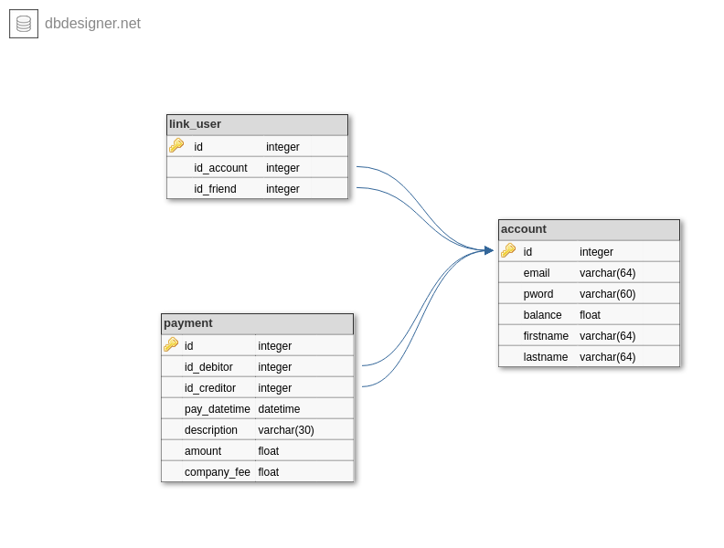

# P6_PayMyBuddy

## Pre-requisites

* Java 11
* MySql 8

## Description

PayMyBuddy allows users to transfer money to other users. 

To accomplish transfer they first need to create an account. Then they can deposit or withdraw money.
In the meantime, they have to add other users to their friend list by regisetering their email.
Finally, they can transfer money from the balance account to anyone in the friends list.
Note that 5% of the amount will be charged at every payment.
     
## Getting started

Before executing the program, you need to create the database (see below for diagram) 
by executing **SOURCE filepath/create_database.sql**. The database connection configuration 
is in *application.properties* file if you need to update username and password.

### UML class diagram 

### Database diagram

